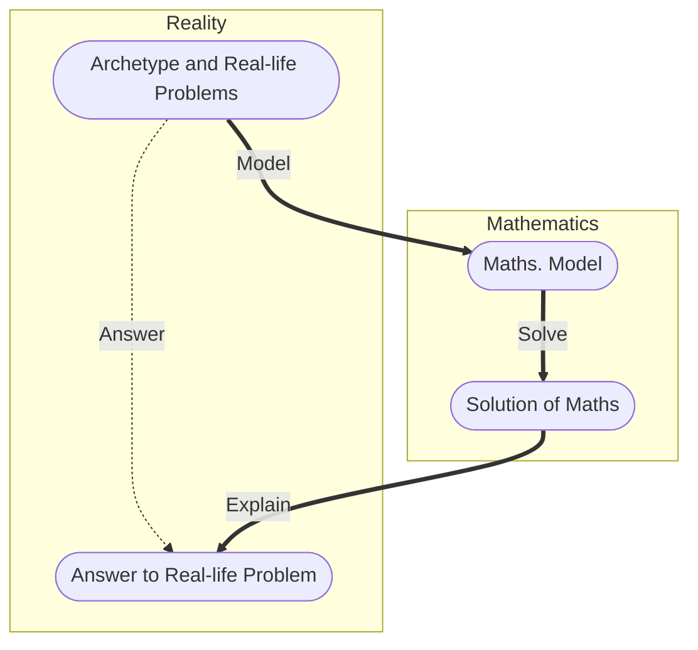

# Model Hunter

## Nature and Purpose of Mathematical Modeling

Various object of interest exists in real life, having problem associating with them to be solved, and anomalies, to be unveiled. Such objects of interest are so-called `archetypes`.

Mathematical modelers uses theories and methods of mathematics to explain `archetypes` and then solve real-life problem associating with them.



## Problems of Different Types

- Prediction: Making prediction about future tendencies of things by analysis of extant data and phenomenons. e.g.

```md
Make a prediction about amount of global CO-2 emission in the coming year 2024.

(Data about CO-2 emission and global reaction from previous years may be given. By interpolating and fitting such tendency is described through a function, and thus future emission could possibly be derived from that function.)
```

- Evaluation: Evaluating a certain policy or strategy by proposing and applying a set of criterion. e.g.

```md
Which engine configuration would achieve commercial aircraft its best performance?

(The key is to define "best performance". Criterion may include speed, durability, comfort, cost, etc. with each factor weighed differently. There's no single optimal set of criterion, however, we must state the reason behind choices and weightings of criterion.)
```

- Principle Analysis: Analyzing internal principles which are explained by mathematics under certain pre-assumptions.  

```md
Below are a graph of yield of a wind power plant and a table of local weather. Does stormy weather positively or negatively impact the yield of the power plant? State your reasons. (graph and table omitted)

(The key is to find relation between occurrence of storms and peaks (or valleys) of power yield. An assumption should first be made and evidences to support, or counter-evidences to undermine such assumption should be given. Necessary theories, such as physical model of a power plant machine in a storm, should be proposed)
```

- Optimization: Propose a policy or strategy to complete a task or excel in a competitive scenario. Such policy or strategy usually have to deal with inevitable trade-offs. e.g.

```md
Propose the best ratio between engine, fuel and payload weights for design of a satellite-rocket.

(The key is to find a combination of engine fuel and payload weight that complete the task of sending rocket into orbit. Engine power of rockets are necessary for taking off and reaching orbit, yet rockets with stronger engines tend to weigh more themselves and thus cannot carry enough fuel or payload. A target-function (or cost-function) should be proposed. Necessary physics like gravitation, should be included.)

```
